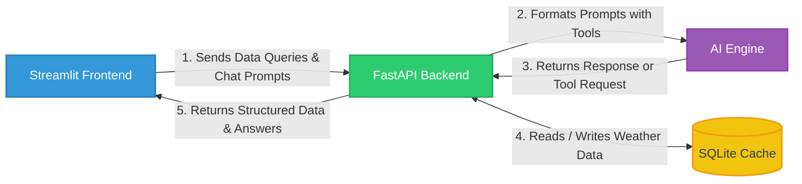

# 🌦️ Weather Analytics Microservice with AI Assistant

A containerized, lightweight weather analytics platform built with FastAPI and Streamlit. 

## 🧠 Core Features

The system maintains a rolling 30-day database cache tracking hourly wind speed and solar radiation metrics for Manila, Tokyo, and New York. All historical data is pulled directly from [Open-Meteo Archive API](https://open-meteo.com/en/docs/historical-weather-api).

The system uses the Interquartile Range (IQR) method to automatically find and filter unusual spikes in weather data. It also features an AI assistant that chats naturally, pulls local data, and highlights weather extremes.

### ⏳ Data Synchronization

The backend runs an automated background worker (`sync_weather_data`) on a configurable interval (`SYNC_INTERVAL_SECONDS`). It automatically downloads, repairs, and saves historical Open-Meteo data into a local SQLite database.

```text
[ Trigger ] ──> Purge records older than rolling history threshold (30 days)
[ Analysis] ──> Query SQLite for the latest cached timestamp to identify missing gaps
[ Request ] ──> Fetch all location data from Open-Meteo.com in a single network call
[ Cleanse ] ──> Run linear series interpolation for missing values & clip bounds
[ Write   ] ──> Filter out timestamps existing in the database and save the new updates
```

### 🔬 Anomaly Algorithmic Selection: Why IQR Instead of Z-Score?
Advantages of using the IQR method over Z-scores for this project:

*   **Works on Real-World Weather Patterns**
    *   Z-score only works if your data is perfectly symmetrical.
    *   In reality, wind speed has sudden storm spikes and solar radiation turns completely off at night, which breaks the Z-score math.
*   **Prevents Self-Blinding**
    *   Big events like typhoons distort standard averages.
    *   This causes the Z-score boundary to pull itself upward, accidentally blinding the system to smaller, subsequent weather changes.
*   **Ignores Broken Sensors and Flukes**
    *   IQR protects your thresholds by focusing exclusively on the normal middle 50% of your data.
    *   This ensures your baseline limits aren't ruined by a single crazy sensor error or a passing storm.

## 🛠️ System Architecture & Layout
The project enforces a separation of concerns, decoupling the frontend interface and backend services.



#### 📂 Project Structure
| File | Description |
| :--- | :--- |
| `frontend/dashboard.py` | Streamlit UI for charts and chat widget. |
| `backend/main.py` | FastAPI entry point and routing logic. |
| `backend/agent.py` | Orchestrates the AI engine, system prompts, and tool selection. |
| `backend/services.py` | Core logic for data gap checking, interpolation, and metrics. |
| `backend/tasks.py` | Cron-like background scripts for pruning and fetching data. |
| `backend/database.py` | SQLAlchemy engine connections and schema models. |

## ⚡ Quick Start

### Prerequisites
Make sure you have [Docker](https://docker.com) and Docker Compose installed on your system.

### Running Locally

#### 1. Clone the Repository
```bash
git clone https://github.com/matangkuwago/weather-microservice.git
cd weather-microservice
```

#### 2. Configure Environment Variables
Create a file named `.env` in the root directory of the project and define your configuration settings:

**Option A: Local Ollama (Recommended for Privacy & Cost)**
```bash
AI_PROVIDER=ollama
OLLAMA_BASE_URL=http://host.docker.internal:11434
# Ensure the model is pulled locally first: ollama pull qwen3.5:9b
OLLAMA_MODEL=qwen3.5:9b
```

**Option B: Cloud APIs**

**For OpenAI**
```bash
AI_PROVIDER=openai
OPENAI_API_KEY=sk-proj-xxxx...
OPENAI_MODEL=gpt-4o
```

**For Anthropic**
```bash
AI_PROVIDER=anthropic
ANTHROPIC_API_KEY=sk-ant-xxxx...
ANTHROPIC_MODEL=claude-sonnet-4-6
```

#### 3. Spin Up the Services
```bash
# create the data directory
mkdir -p data

# launch the containers
docker compose up --build
```

#### 4. Access the Applications
Once the build completes and the services are running, open your browser to access:
* **Streamlit Dashboard UI**: [http://localhost:8501](http://localhost:8501)
* **FastAPI Interactive API Docs**: [http://localhost:8000/docs](http://localhost:8000/docs)

### 💬 Conversational Starters to Try in the Dashboard

The assistant provides a conversational interface specialized for local weather analytics, allowing users to query and analyze historical metrics across multiple cities using natural language.

* “Which site had the highest average solar radiation last week?”
* “Were there any extreme wind speed anomalies detected in Manila between June 1st and June 10th? Use an IQR factor threshold of 2.5.”
* “Compare the maximum wind speed seen in Tokyo versus New York over the last 14 days.”
* “Look at the solar data for Manila over the past month. Does the radiation profile show any abnormal noon-time dropouts?”
